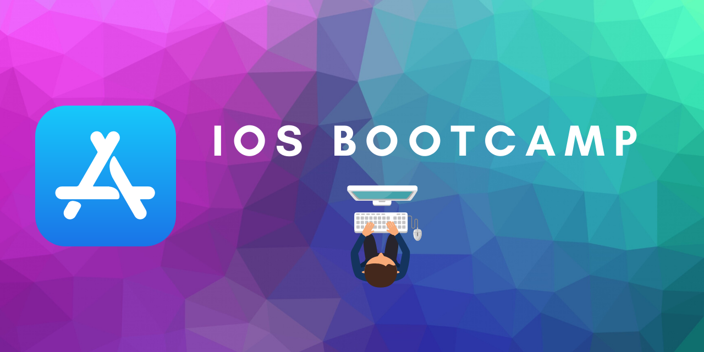

# Ios-Development-Bootcamp
Comprehensive Udemy Modules Dedicated to Understanding SwiftUI fundamentals. 

## Module 1 - IOS/XCODE INTERFACE BUILDER - START
* How to size and arrange UI Elements 
* How to add custom image assets to Xcode projects
* How to create app icons and size them for all resolutions
* How to run apps on the iOS Simulator as well as sideload to a physical device

