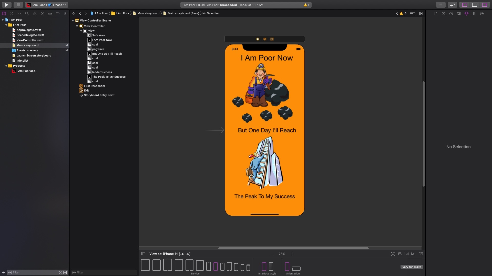
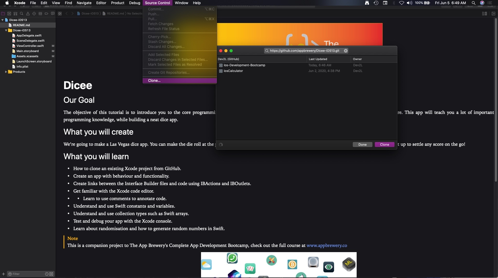

# Ios-Development-Bootcamp
Comprehensive Udemy Modules Dedicated to Understanding SwiftUI fundamentals. 

## Module 1 - IOS/XCODE INTERFACE BUILDER
* How to size and arrange UI Elements 
* How to add custom image assets to Xcode projects
* How to create app icons and size them for all resolutions
* How to run apps on the iOS Simulator as well as sideload to a physical device
 

## Module 2 - INTRODUCTION TO IOS ENVIROMENT
* Learn to clone projects from GitHub.
* Link design with code via IBActions and IBOutlets.
* Learn to detect user interaction through UIButtons. Understand and use Swift variables, constants and collection types.
* Learn about printing and commenting in Swift.
* Learn about randomisation in swift and range operators. Learn to use Image Literals in code.
* Learn to use Swift Playgrounds.
* Understand the data type system and the primitive data types such as Strings, Ints and Doubles.
 

